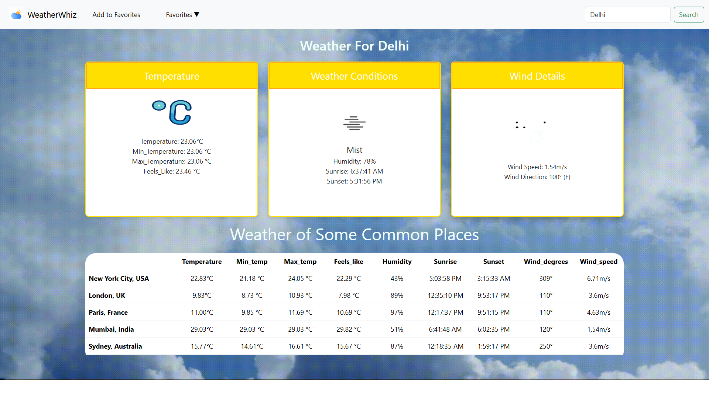

# Weather Website 🌦
A simple and interactive weather website that provides real-time weather updates for any city. Enter a city name to get current weather details, including temperature, humidity, wind speed, and conditions.

## Features
- **Real-time Weather Data**: Get up-to-date weather information for any city.
- **Search Functionality**: Easily search for weather data by entering the name of a city.
- **User-Friendly Interface**: A clean, simple, and intuitive design for ease of use.
- **Responsive Design**: Optimized for both desktop and mobile viewing.
- **5-day Forecast**: View the upcoming weather forecast for five days.
- **Favorite Cities**: Save and delete favorite cities for quick access.

## Built With
- **HTML & CSS**: Structure and styling
- **JavaScript & React**: Front-end functionality
- **OpenWeather API**: For real-time and forecast weather data

### HOMEPAGE

### City Weather

### 5-Day Forecast

## How to Use

1. **Click the link below** to access the website.
2. **Enter a city name** to get the latest weather details.
3. **View** current conditions, temperature, and more!

[Access the Weather Website](https://weather-website-mhc7.onrender.com)
